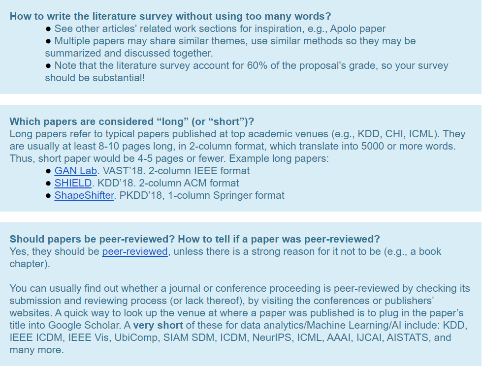
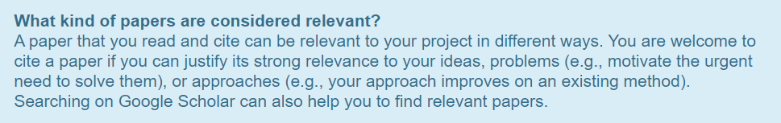

# First Project Deliverables
* Due:  Friday 10-9-20
1. Proposal Document - 7.5% of course grade
2. Proposal Presentation Slides and Video - 5% of course grade (video recording)

## 1. Proposal Document
* Two pages (max, excluding references page), 1 inch margins (min), 11 point font (min), PDF with Latex format recommended.
* Your document should be **self-contained**.
	* For example, do not just say: "We plan to implement Smith's Foo-Tree data structure [Smith86], and we will study its performance." Instead, you should briefly review the key ideas in the references, and describe clearly the alternatives that you will be examining.
* Answer 9 Heilmeir questions
	1. What are you trying to do? Articulate your objectives using absolutely no jargon.
	2. How is it done today; what are the limits of current practice?
	3. What's new in your approach? Why will it be successful?
	4. Who cares?
	5. If you're successful, what difference and impact will it make, and how do you measure them (e.g., via user studies, experiments, ground truth data, etc.)?
	6. What are the risks and payoffs?
	7. How much will it cost?
	8. How long will it take?
	9. What are the midterm and final "exams" to check for success? How will progress be measured?
	
### Required components for topic
* You need to justify that the topic is interesting, relevant to the course, and is of suitable difficulty.
1. Large, real dataset
2. Non-trivial analysis/algorithms/computation performed on the dataset (e.g., computing basic statistics, like average, min/max will not be enough)
3. Interactive user interface that interacts with the algorithms (can be visual, voice-controlled, on tablet, desktop, etc.)

### Grading Scheme
* 60% for the literature survey
* 30% for innovation
* 10% for plan of activities

* For every Heilmeier question that's not mentioned, deduct 5%.
* You may consider organizing your proposal based on the Heilmeier questions (e.g., each section addresses one question)
* Your literature survey should have at least **3 papers or book chapters per group member** (outside of any required reading for the class).
	* Short papers, like PNAS, Nature, Science papers, count as 0.5.
	* Copying the abstract of the papers is obviously prohibited, constituting plagiarism.
	* For each paper, describe
		* the main idea,
		* why (or why not) it will be useful for your project, and
		* its potential shortcomings, that you will try to improve upon.
* You may use any citation style (e.g., APA, Chicago). Google Scholar supports a wide range of citation styles; it also provides BibTeX (needed if your team is using LaTeX).
* Please make sure to cite your references in your literature survey.
* **Clear problem definition**: give a precise formal problem definition, in addition to a jargon-free version (for Heilmeier question #1).
* Provide a **plan** of activities and time estimates, per group member. **List what each group member has done, and will do.**
* Team's contact person submits a softcopy, named teamXXXproposal.pdf, via Canvas (i.e., that person submits for the whole team), where XXX is the team number (e.g., team001proposal.pdf for team 1)
* [-5% if not included] Distribution of team member effort. Can be as simple as "all team members have contributed similar amount of effort". If effort distribution is too uneven, I may assign higher scores to members who have contributed more.

### More on Literature Survey

## 2. Proposal Presentation Slides and Video

1. A presentation slide deck via Canvas, called teamXXslides.pdf, where XX is the team number (e.g., team001slides.pdf for team 1). **PDF only**
2. A 2-minute video presentation (one presentation per team), called teamXXXproposal.mp4 (or .avi or .mov), where XX is the team number (e.g., 001 for team 1).
	* Your video should show your slides (e.g., as pdf on your computer screen via screen capture, say using Quicktime, MonoSnap, etc.) with voice narration; it is up to you whether to show your face. You should be able to create this recording quickly with little effort – no need to do any special video or audio editing.

### Grading Scheme
**[45%]** You must answer the Heilmeier questions. 5% for each question. If a question doesn’t apply, say so.

**[15%]** Brief literature survey. Can be combined with Heilmeier question(s).

**[10%]** Expected innovation. Can be combined with Heilmeier question(s).

**[10%]** Plan of activities

**[20%]** Presentation delivery

**[-5%]** Illegible text, tiny figures, bad color contrast, etc.

**[-5%]** Overrun.

* In addition, you may lose additional points for required content that is not covered within the time limit.
* Your presentation does NOT need to strictly follow your project proposal document. For example, you can talk about ideas and materials that your team has come up recently.
* Points will NOT be deducted or awarded based on the number of presenters. We saw great presentations delivered by teams having various numbers of presenters.